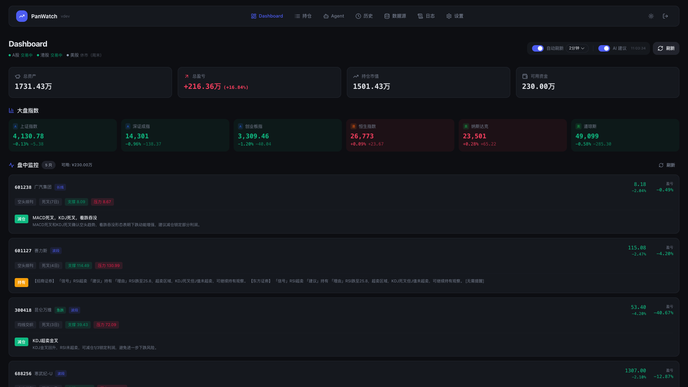
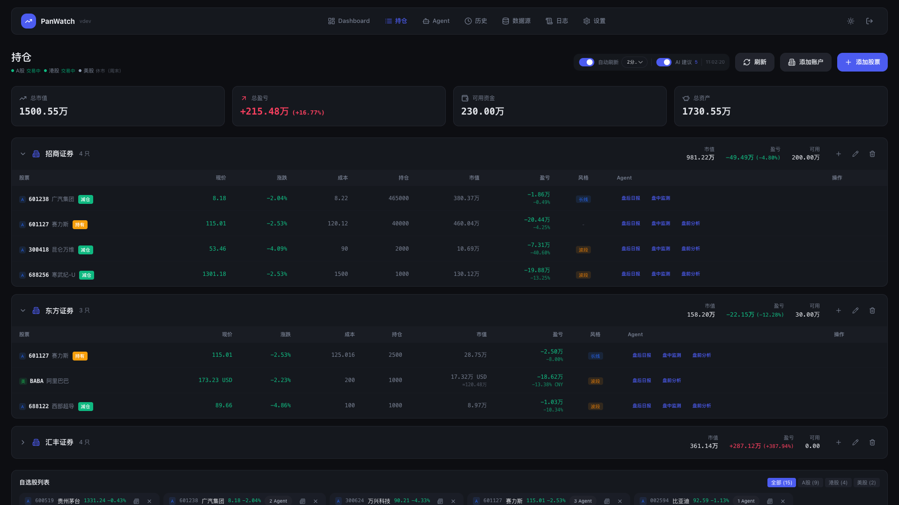
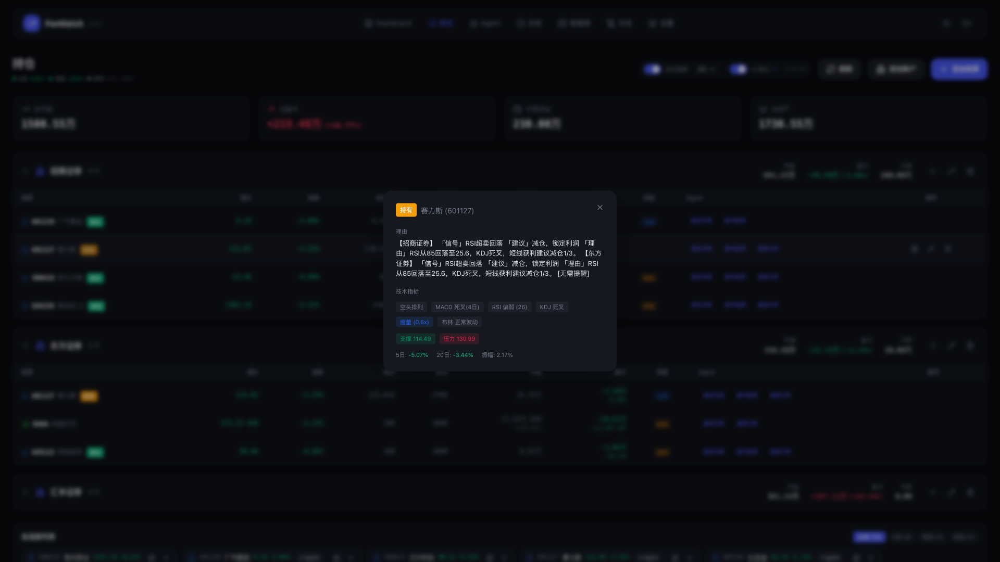
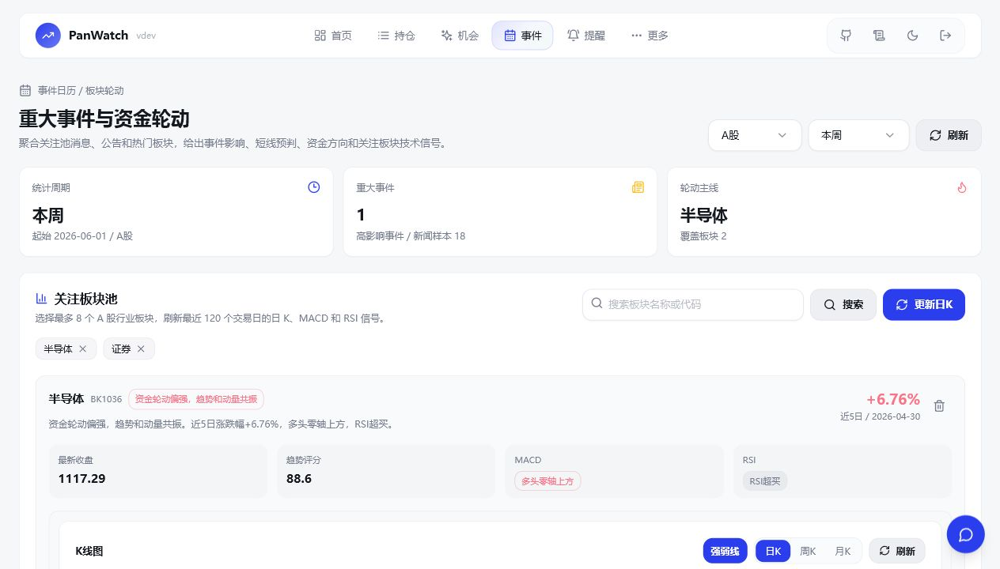
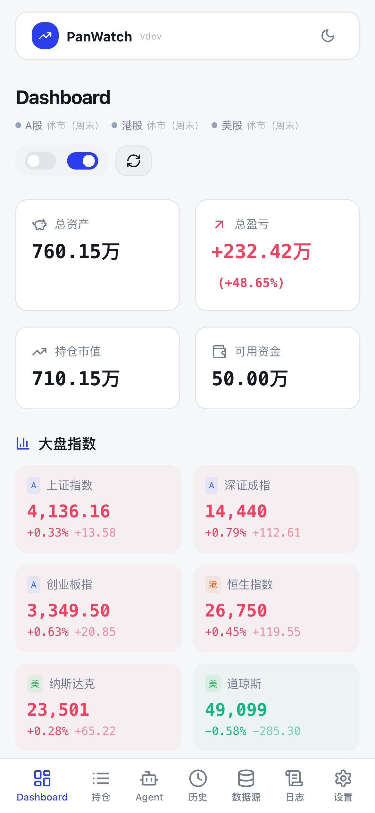

# 盯盘侠 PanWatch

**自托管 AI 盯盘助手 · 集成 [TradingAgents](https://github.com/TauricResearch/TradingAgents) 多 Agent 投资决策** — A 股 / 港股 / 美股实时监控、持仓管理、事件日历、板块轮动、智能分析、全渠道推送

[](https://github.com/PotatoChipking/finance/stargazers)
[](LICENSE)
[](https://github.com/PotatoChipking/finance/commits/main)



| 持仓管理 | AI 建议 |
|:---:|:---:|
|  |  |

| 事件日历与板块池 |
|:---:|
|  |

<details>
<summary>移动端截图</summary>



</details>

> 💡 如果盯盘侠对你有帮助，点右上角 ⭐ **Star** 支持一下 —— 这是对开源项目最好的鼓励，也能让更多人发现它。

## 🧠 深度分析：TradingAgents 多 Agent 决策

接入 [TradingAgents](https://github.com/TauricResearch/TradingAgents)（76k+ star）多 Agent 投资决策框架，在持仓页或事件日历的板块龙头股上点 🧠 图标即可触发：

- **4 类分析师**（技术 / 情绪 / 新闻 / 基本面） → **看多看空辩论** → **风控审查** → **PM 整合决策**
- 3-5 分钟输出完整推理链，结论同步推送到 Telegram / 微信 / 钉钉
- 支持未加入自选池的板块龙头股临时分析，适合从事件和板块轮动里快速下钻
- 默认 deepseek-chat，单次 ~$0.05，月度预算可控
- 配置指南：[`.docs/tradingagents/USER_GUIDE.md`](.docs/tradingagents/USER_GUIDE.md)

## 📅 事件日历与板块轮动

新增独立 `/events` 页面，把“消息面事件”和“资金去向”放在同一个工作台里：

- **重大事件日历**：按本周 / 本月 / 近 30 天聚合关注池新闻和公告，给出影响等级、情绪方向、关联板块和短线预判
- **资金轮动判断**：结合热门行业板块涨跌幅、成交额、龙头股表现，识别资金聚焦、活跃轮动、降温退潮等状态
- **关注板块池**：搜索并关注最多 8 个 A 股行业板块，刷新最近 120 个交易日真实板块指数日 K
- **技术信号**：自动计算板块 MA、MACD、RSI、近 1/5/20 日涨跌幅、趋势评分和轮动状态
- **龙头股下钻**：板块卡片内展示强势成分股，可一键触发 TradingAgents 深度分析

## 为什么选择盯盘侠？

- **数据私有** — 自托管部署，持仓数据不经过任何第三方
- **AI 原生** — 不是简单的指标堆砌，而是让 AI 理解你的持仓、风格和目标
- **事件驱动** — 重大消息、板块日 K、MACD/RSI 和资金轮动放在同一个页面判断
- **开箱即用** — 本地一键启动，5 分钟完成配置
- **个人维护** — 本仓库由 [PotatoChipking](https://github.com/PotatoChipking) 维护

## 核心功能

<details>
<summary><b>智能 Agent 系统</b></summary>

| Agent | 触发时机 | 功能 |
|-------|---------|------|
| **盘前分析** | 每日开盘前 | 综合隔夜美股、新闻消息、技术形态，给出今日操作策略 |
| **盘中监测** | 交易时段实时 | 监控异动信号，RSI/KDJ/MACD 共振时推送提醒 |
| **盘后日报** | 每日收盘后 | 复盘当日走势，分析资金流向，规划次日操作 |
| **新闻速递** | 定时采集 | 抓取财经新闻，AI 筛选与持仓相关的重要信息 |

</details>

<details>
<summary><b>事件日历 & 板块池</b></summary>

- **事件影响评估**：结合消息关键词、时效、来源和情绪，标记高 / 中 / 低影响事件
- **消息面预判**：对偏多、偏空、中性事件给出短线影响和观察点
- **板块关注池**：支持搜索 A 股行业板块、添加关注、删除关注、手动刷新日 K
- **板块技术面**：展示真实板块指数日 K，并计算 MACD、RSI、MA 和趋势评分
- **资金轮动**：按成交额、涨跌幅和龙头股扩散情况判断资金聚焦 / 活跃 / 降温
- **TradingAgents 接入**：点击板块龙头股即可做未绑定股票的临时深度分析

</details>

<details>
<summary><b>专业技术分析</b></summary>

- **趋势指标**：MA 多空排列、MACD 金叉死叉、布林带突破
- **动量指标**：RSI 超买超卖、KDJ 钝化与背离
- **量价分析**：量比异动、缩量回调、放量突破
- **Price Action**：识别 20 日高点放量突破、突破后回踩确认、上升趋势结构，并生成 ATR 止损与风险收益目标位
- **形态识别**：锤子线、吞没形态、十字星等 K 线形态
- **支撑压力**：自动计算多级支撑位和压力位

</details>

<details>
<summary><b>底仓 VWAP 回归做T</b></summary>

- **适用范围**：仅扫描已有 A 股持仓；需要在持仓编辑中维护“可卖底仓”和账户可用资金
- **低吸条件**：日线趋势未破、接近支撑、低于当日 VWAP、分钟 K 止跌，T Score 达到 70 才提醒
- **状态闭环**：收到低吸提醒后需在持仓页确认买入，系统才会继续监控 VWAP / 目标位卖点
- **风险控制**：单次默认使用可卖底仓 20%，按 100 股取整；每股每天最多完成一次，跌破止损或信号超时自动失效
- **执行边界**：只生成提醒，不连接券商、不自动下单；每条信号包含建议数量、入场、目标、止损和失效条件
- **分钟行情**：A 股 / 港股 1 分钟数据使用腾讯行情，5 分钟 K 由后端按交易时段聚合，不再回退东方财富分钟接口

</details>

<details>
<summary><b>Price Action 机会策略</b></summary>

- **后端信号因子**：基于前复权日 K 计算突破、回踩确认、趋势结构、ATR 风控和 PA 评分
- **机会池接入**：在「更多 → 机会」点击刷新后，PA 会参与候选评分；可使用「Price Action」策略筛选查看结果
- **交易计划**：候选自动生成入场区间、突破位、支撑位、止损位、目标位和结构失效条件
- **K 线标注**：日 K 自动展示 PA 支撑/压力、止损/目标横线，以及历史突破和回踩确认标记
- **条件提醒**：支持 PA 评分、PA 突破、PA 回踩确认和 PA 结构失效条件，并按信号日期去重
- **策略配置**：在「策略」页可启停 Price Action，并调整风险等级和策略权重

PA 明细接口：

```http
GET /api/klines/{symbol}/price-action?market=CN&days=180
```

</details>

<details>
<summary><b>多市场 & 多账户</b></summary>

- **覆盖市场**：A 股、港股、美股实时行情
- **账户管理**：支持多券商账户独立管理，汇总展示总资产
- **交易风格**：按短线/波段/长线分别设置，AI 建议更精准

</details>

<details>
<summary><b>全渠道通知</b></summary>

Telegram / 企业微信 / 钉钉 / 飞书 / Bark / 自定义 Webhook

</details>

<details>
<summary><b>价格提醒</b></summary>

- 支持价格、涨跌幅、成交额、量比、PA 评分/突破/回踩/结构失效等条件组合（AND / OR）
- 支持交易时段/全天生效、冷却时间、日触发上限、重复触发模式
- 到期时间使用弹窗内日期面板 + `HH:mm` 输入，留空表示永不过期
- 可按规则选择通知渠道，不选则走系统默认渠道

</details>

## 快速开始

```bash
git clone https://github.com/PotatoChipking/finance.git
cd finance

make dev-api
make dev-web
```

访问前端 `http://localhost:5183`，首次使用设置账号密码即可。

### 🐳 Docker 一键部署（推荐生产/服务器）

```bash
git clone https://github.com/PotatoChipking/finance.git
cd finance

cp .env.example .env            # 按需填写 AI_API_KEY / 登录账号等（可留默认先跑起来）
docker compose up -d --build    # 用当前源码构建镜像并后台启动
```

浏览器打开 `http://<服务器IP>:8000` 即可。镜像完全由本仓库源码构建，不依赖任何外部镜像。

```bash
docker compose logs -f                    # 看日志
git pull && docker compose up -d --build  # 升级：拉最新代码后重建
docker compose down                       # 停止（数据保留在 panwatch_data 卷里）
```

数据（SQLite、Playwright 浏览器、运行时文件）持久化在 `panwatch_data` 卷，升级不丢。

<details>
<summary>环境变量</summary>

| 变量名 | 说明 | 默认值 |
|--------|------|--------|
| `AUTH_USERNAME` | 预设登录用户名 | 首次访问时设置 |
| `AUTH_PASSWORD` | 预设登录密码 | 首次访问时设置 |
| `JWT_SECRET` | JWT 签名密钥 | 自动生成 |
| `DATA_DIR` | 数据存储目录 | `./data` |
| `TZ` | 应用时区（影响 Agent 调度触发时间与时间展示） | `Asia/Shanghai` |
| `PLAYWRIGHT_SKIP_BROWSER_INSTALL` | 跳过首次 Chromium 安装（不需要截图时可用） | 未设置 |
| `UPDATE_CHECK_DOCKER_REPO` | 升级检测的镜像仓库（如 `你的用户名/panwatch`）。**默认留空即不检测**，不依赖任何第三方镜像；自建并发布了镜像才需要设置 | 未设置（不检测） |
| `LOG_LEVEL` | 控制台日志级别。默认 `INFO`（只输出业务事件 + 错误）；排查问题时设 `DEBUG` 可看到调度心跳、采集过程等底层日志。UI 日志板始终保留完整记录，不受影响 | `INFO` |
| `HTTP_PROXY` / `HTTPS_PROXY` / `http_proxy` | 出站 HTTP 代理。三种配置方式任选其一: ① 启动前 `export HTTP_PROXY=...`；② `.env` 里写 `http_proxy=http://host:port`；③ UI「设置 → 全局 HTTP 代理」。三者优先级:外部环境变量 > UI > `.env`。生效后所有 httpx 客户端走代理。`NO_PROXY` 默认包含 `localhost,127.0.0.1` | 未设置 |

</details>

<details>
<summary>WSL 部署代理说明</summary>

如果在 WSL 中部署，并且宿主机开启了本地代理，不要在 WSL 里直接配置 `http://127.0.0.1:端口`。  
在 WSL 内部，`127.0.0.1` 指向的是 WSL 自己，不是 Windows 宿主机；需要代理的数据源可能因此连接失败。持仓页分时图和 5 分钟 K 线使用腾讯行情，通常不需要为东方财富分钟接口单独配置代理。

建议先在 WSL 中查看宿主机地址：

```bash
cat /etc/resolv.conf | grep nameserver
```

假设输出为：

```text
nameserver 172.24.112.1
```

则代理应配置为：

```bash
export HTTP_PROXY=http://172.24.112.1:8897
export HTTPS_PROXY=http://172.24.112.1:8897
```

或者在 `.env` / UI「设置 → 全局 HTTP 代理」中填写：

```text
http://172.24.112.1:8897
```

可用下面的命令在 WSL 内验证腾讯 A 股分钟 K 线是否能访问：

```bash
curl 'https://web.ifzq.gtimg.cn/appstock/app/kline/mkline?param=sh600519,m1,,20'
```

如果返回内容中包含 `data` 和 `m1`，说明腾讯分钟线可用；如果连接失败或返回空，再检查 WSL 网络和全局代理配置。

</details>

<details>
<summary>首次配置</summary>

1. 访问 Web 界面，设置登录账号
2. **设置 → AI 服务商**：配置 OpenAI 兼容 API（支持 OpenAI / 智谱 / DeepSeek / Ollama 等）
3. **设置 → 通知渠道**：添加 Telegram 或其他推送渠道
4. **持仓 → 添加股票**：添加自选股，启用对应 Agent

</details>

<details>
<summary>本地开发</summary>

**环境要求**：Python 3.10+ / Node.js 18+ / pnpm

```bash
# 一键开发（推荐）
make dev-api          # 启动后端（自动 venv+依赖，监听 :8000）
make dev-web          # 启动前端（自动 pnpm install，监听 :5183）

# 或手动
python -m venv venv && source venv/bin/activate
pip install -r requirements.txt
python server.py                              # 后端 :8000

cd frontend && pnpm install && pnpm dev       # 前端 :5183
```

前端 dev server 跑在 `http://localhost:5183`，并把 `/api` 代理到 `127.0.0.1:8000`。
前端用 `:5183` 而非默认 `:5173`，是为了和 BeeCount-Cloud 等本地常驻前端错开。

</details>

<details>
<summary><b>技术栈</b></summary>

**后端**：FastAPI / SQLAlchemy / APScheduler / OpenAI SDK

**前端**：React 18 / TypeScript / Tailwind CSS / shadcn/ui

</details>

## 贡献

本仓库由 [PotatoChipking](https://github.com/PotatoChipking) 维护。
自定义 Agent 和数据源开发请参考 [贡献指南](CONTRIBUTING.md)。

## Runtime Notes

- Recommended backend startup: `python server.py`.
- `server.py` remains the CLI shell and delegates to the FastAPI app.
- Direct startup with `uvicorn src.web.app:app` is supported because `src.web.app` now delegates to the same lifespan initialization path. This keeps migrations, authentication initialization, logging, schedulers, and runtime services aligned across both entry points.
- The maintained GitHub remote is `https://github.com/PotatoChipking/finance.git`. The original PanWatch repository can be kept as `upstream` for reference.

## License

[MIT](LICENSE)
